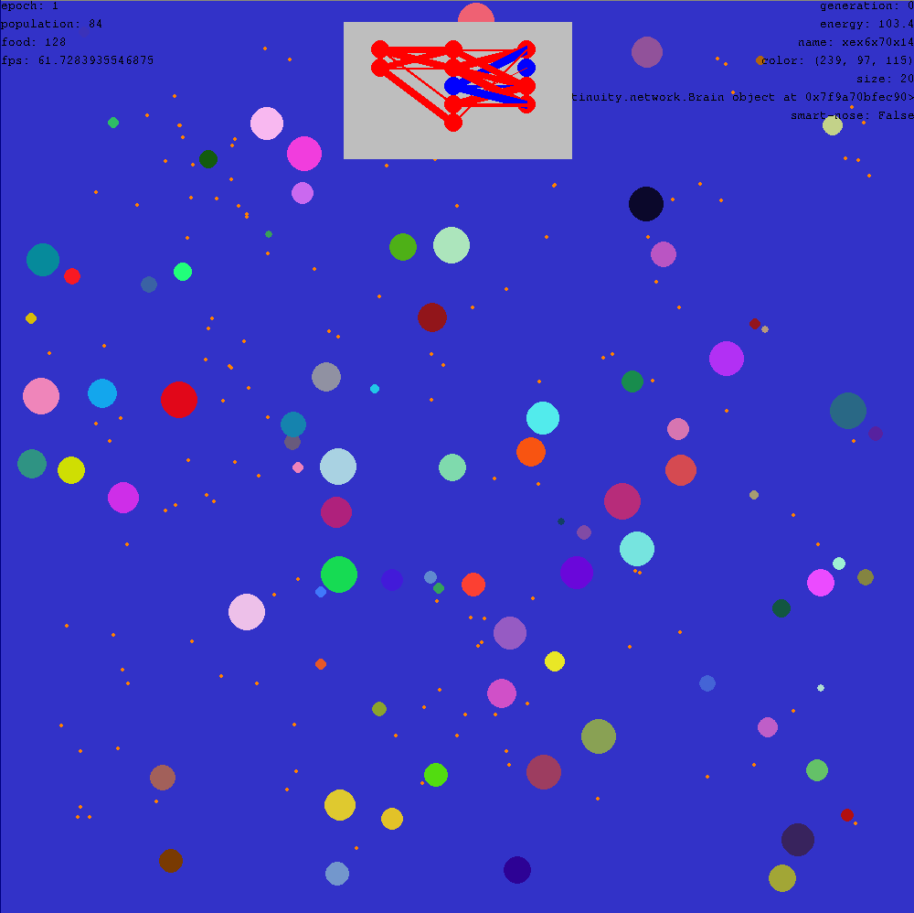

# Continuity
"a pretty cool life simulator"

Continuity is an artificial life simulator I am developing as part of my high school capstone project. It simulates a group of creatures and demonstrates neuroevolution through natural selection.

### Roadmap
- [X] Physics Simulation
- [X] Creature Simulation
- [X] Asexual Reproduction
- [X] Genetic Mutation
- [X] Command Line Interface
- [X] Checkpoints / Save files
- [X] Neuroevolution
- [ ] Polish

Running
-------

### Nix / Unix
The recommended way of running continuity on unix systems is by using the nix flake. Simply install Nix on your system and run `nix --extra-experimental-features nix-command --extra-experimental-features flakes run github:AndreiSva/continuity`. This will download all the dependencies and run the simulation.

### Windows
Running continuity on windows is not officially supported, but you should be able to install the needed dependencies manually by using the requirements.txt file and running the setup.py script manually. However, there is no guarantee that this will work in the future.
